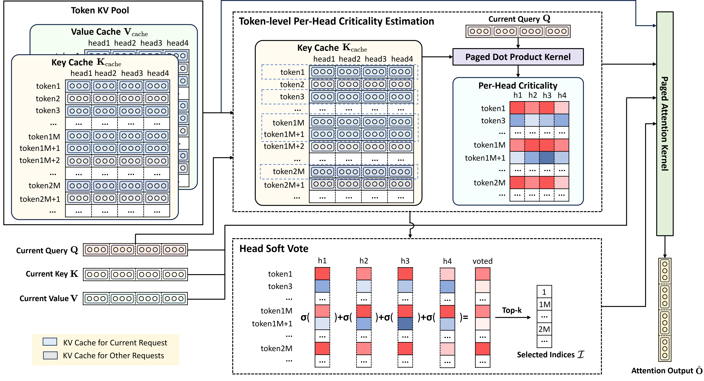

<div align="center">
<h1>🔍 TokenSelect: Efficient Long-Context Inference and Length Extrapolation for LLMs via Dynamic Token-Level KV Cache Selection</h1>
<h4>
<a href="https://arxiv.org/abs/2411.02886">📄 Paper (Arxiv)</a> &nbsp; 
<!-- <a href="https://tokenselect.github.io">🌐 Project Page</a> &nbsp;  -->
</h4>
</div>
 
## 📝 Key Takeaways
💡 **Dynamic Token-Level KV Cache Selection**: Use *Query-Key dot products* to measure pre-head KV Cache criticality at *token-level*.

💡 **Per-head Soft Voting Mechanism**: Calculate the
per-head criticality, normalize through softmax, and sum for all heads, offers better performance and efficiency. 

💡 **Selection Cache**: Allow consecutive similar queries to share token selection results, thereby
reducing the selection frequency while ensuring its effectiveness.

✅ **TokenSelect** – A *model-agnostic, training-free* method for efficient and accurate long-context inference. It selectively involves a small number of critical KV cache tokens in the attention calculation without sacrificing accuracy.

📊 **Result** – Up to $23.84\times$ speedup in attention computation and up to $2.28\times$ acceleration in end-to-end latency!

<div align="center">

</div>

<!--  -->
Performance Comparison on a single A100-80G. The prompt is:

```python
prompt = "The grass is green. The sky is blue. The sun is yellow. Here we go. There and back again. " * 5000 + f"The pass key is 71432. Remember it. 71432 is the pass key. " + "The grass is green. The sky is blue. The sun is yellow. Here we go. There and back again. " * 5000 + "What is the pass key?"
```
Feel free to replicate this using the [scripts/serve.sh](scripts/serve.sh) and [benchmark/send_request.py](benchmark/send_request.py) provided. Please refer to our [paper](https://arxiv.org/abs/2411.02886) for more evaluation results.

<video src="https://private-user-images.githubusercontent.com/64088736/418362966-80237a8e-25ab-49a2-b44f-a17a6be88908.mov?jwt=eyJhbGciOiJIUzI1NiIsInR5cCI6IkpXVCJ9.eyJpc3MiOiJnaXRodWIuY29tIiwiYXVkIjoicmF3LmdpdGh1YnVzZXJjb250ZW50LmNvbSIsImtleSI6ImtleTUiLCJleHAiOjE3NDA5MzM3NDQsIm5iZiI6MTc0MDkzMzQ0NCwicGF0aCI6Ii82NDA4ODczNi80MTgzNjI5NjYtODAyMzdhOGUtMjVhYi00OWEyLWI0NGYtYTE3YTZiZTg4OTA4Lm1vdj9YLUFtei1BbGdvcml0aG09QVdTNC1ITUFDLVNIQTI1NiZYLUFtei1DcmVkZW50aWFsPUFLSUFWQ09EWUxTQTUzUFFLNFpBJTJGMjAyNTAzMDIlMkZ1cy1lYXN0LTElMkZzMyUyRmF3czRfcmVxdWVzdCZYLUFtei1EYXRlPTIwMjUwMzAyVDE2MzcyNFomWC1BbXotRXhwaXJlcz0zMDAmWC1BbXotU2lnbmF0dXJlPTg4YWZmYmNhZDU3OGE4ODEyZjg0MGIwOThiMDcwNzUwOTY3NzE0ZjVjMjdmODIyZWRjNDQyZWUxYjU4NDI1ZDcmWC1BbXotU2lnbmVkSGVhZGVycz1ob3N0In0.Uzh5fvyxkb51Q7VCUMA_TGeONZT8B6F42OmBTXtSVCI" data-canonical-src="https://private-user-images.githubusercontent.com/64088736/418362966-80237a8e-25ab-49a2-b44f-a17a6be88908.mov?jwt=eyJhbGciOiJIUzI1NiIsInR5cCI6IkpXVCJ9.eyJpc3MiOiJnaXRodWIuY29tIiwiYXVkIjoicmF3LmdpdGh1YnVzZXJjb250ZW50LmNvbSIsImtleSI6ImtleTUiLCJleHAiOjE3NDA5MzM3NDQsIm5iZiI6MTc0MDkzMzQ0NCwicGF0aCI6Ii82NDA4ODczNi80MTgzNjI5NjYtODAyMzdhOGUtMjVhYi00OWEyLWI0NGYtYTE3YTZiZTg4OTA4Lm1vdj9YLUFtei1BbGdvcml0aG09QVdTNC1ITUFDLVNIQTI1NiZYLUFtei1DcmVkZW50aWFsPUFLSUFWQ09EWUxTQTUzUFFLNFpBJTJGMjAyNTAzMDIlMkZ1cy1lYXN0LTElMkZzMyUyRmF3czRfcmVxdWVzdCZYLUFtei1EYXRlPTIwMjUwMzAyVDE2MzcyNFomWC1BbXotRXhwaXJlcz0zMDAmWC1BbXotU2lnbmF0dXJlPTg4YWZmYmNhZDU3OGE4ODEyZjg0MGIwOThiMDcwNzUwOTY3NzE0ZjVjMjdmODIyZWRjNDQyZWUxYjU4NDI1ZDcmWC1BbXotU2lnbmVkSGVhZGVycz1ob3N0In0.Uzh5fvyxkb51Q7VCUMA_TGeONZT8B6F42OmBTXtSVCI" controls="controls" muted="muted" class="d-block rounded-bottom-2 border-top width-fit" style="max-height:640px; min-height: 200px">
</video>

### 🛠️ Install

TokenSelect is built on top of [SGLang](https://github.com/sgl-project/sglang) and [FlashInfer](https://github.com/flashinfer-ai/flashinfer).

```
pip install sglang==0.2.13
pip install torch==2.4.0 --index-url https://download.pytorch.org/whl/cu121 
pip install flashinfer-python -i https://flashinfer.ai/whl/cu121/torch2.4
```

### 🎯 Quick Start

Launch SGLang server with TokenSelect.

```bash
bash scripts/serve.sh
```

Send request to SGLang server using OpenAI Python Client. You can also use the [benchmark/send_request.py](benchmark/send_request.py) script.

```python
import openai

client = openai.Client(base_url=f"http://127.0.0.1:62726/v1", api_key="None")

prompt = "The grass is green. The sky is blue. The sun is yellow. Here we go. There and back again. " * 1000 + f"The pass key is 71432. Remember it. 71432 is the pass key. " + "The grass is green. The sky is blue. The sun is yellow. Here we go. There and back again. " * 1000 + "What is the pass key?"

response = client.chat.completions.create(
    model="Qwen/Qwen2-7B-Instruct",
    messages=[
        {"role": "user", "content": prompt},
    ],
    temperature=0,
)
print(response)
```

### 📊 Experiment

#### Evaluation on InfiniteBench

Download data from [https://github.com/OpenBMB/Infini](https://github.com/OpenBMB/InfiniteBench).

```bash
# using llama3
bash scripts/infinitebench-mp-llama.sh
# using qwen2
bash scripts/infinitebench-mp-qwen.sh
```

#### Evaluation on RULER

Download data from [https://github.com/NVIDIA/RULER](https://github.com/NVIDIA/RULER).

```bash
cd ruler
# using llama3
# bash run.sh model_name benchmark_name config_name port (choose an idle port)
bash scripts/run.sh llama3-8b-inst synthetic llama-token-retrieval 63333
# using qwen2
# bash run.sh model_name benchmark_name config_name port (choose an idle port)
bash scripts/run.sh qwen2-7b-inst synthetic qwen-token-retrieval 63333
```